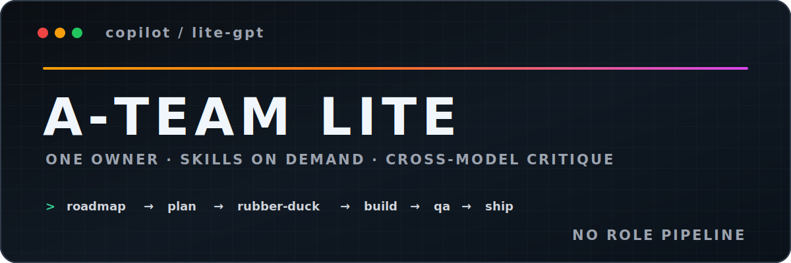

# A-Team — Lite

A **lite** variant of the [A-Team](https://github.com/sinedied/a-team) Copilot squad. Instead of a relay of specialized subagents, **one agent follows a playbook** (in `AGENTS.md`) and pulls **on-demand skills** only when a task needs one. Faster, fewer tokens, less ceremony — the same disciplined loop.

*"I love it when a plan comes together."* — Hannibal

## How it works

There are **no custom subagents**. The primary agent runs the whole loop itself, using the built-in **plan mode** and **/rubber-duck**, guided by `AGENTS.md`:

1. **Roadmap** (new project / reprioritize) → the `roadmap` skill writes `docs/specs/roadmap.md`.
2. **Plan** a feature — plan mode (problem → approach → subtasks → acceptance scenarios → decisions).
3. **Implement** — pull `brand` + `frontend-design` for UI work.
4. **Review (static)** — `/rubber-duck` on the **opposite-provider SOTA at xhigh** (Claude↔GPT) for a diverse perspective; self-review fallback.
5. **Verify (dynamic)** — the `qa` skill: run it, execute acceptance scenarios, try to break it (web UI via `chrome-devtools`).
6. **Fix + commit** — root-cause fix **plus a regression test**; conventional commits.

Compared to the full squad, lite keeps the **single cross-provider review** but drops the heavier 2-parallel + consolidation protocol — the speed/token trade that defines lite.

## Setup

Add the lite squad to your project:

```bash
cd my-project
```

**Mac/Linux:**
```bash
curl -fsSL https://raw.githubusercontent.com/sinedied/a-team/lite/setup.sh | bash -s -- -v lite
```

**Windows (PowerShell):**
```powershell
iwr -useb https://raw.githubusercontent.com/sinedied/a-team/lite/setup.ps1 -OutFile setup.ps1; .\setup.ps1 -v lite; rm setup.ps1
```

Files are installed in the current directory. Existing files are never overwritten without confirmation. The lite playbook lives in a marker-delimited block (`<!-- A-TEAM:START -->` … `<!-- A-TEAM:END -->`) in `AGENTS.md`: on install it's added to (or, on re-install, refreshed in place within) your existing `AGENTS.md`, preserving anything you wrote outside the markers. `-v` accepts any tag or branch.

## Skills

Lite ships on-demand skills. Only each skill's short description is always visible (for activation); its full body loads only when the trigger matches — so the always-on cost is small.

| Skill | Use when |
|-------|----------|
| **roadmap** | Starting a project or reprioritizing — create/iterate `docs/specs/roadmap.md` (interview, validation, adversarial review). |
| **brand** | Establishing or evolving the visual identity in `DESIGN.md` (Google spec; validated with `npx @google/design.md lint`). |
| **frontend-design** | Building UI that avoids generic AI aesthetics. |
| **marketing** | Positioning, messaging, and promo copy → `docs/marketing/`. Truth-checked, anti-slop. |
| **qa** | The verify step — run the build, execute acceptance scenarios, probe edge cases (web UI via `chrome-devtools`). |
| **skill-builder** | Capture a repeatable workflow as a new skill, or refine/retire one. Make the squad your own. |
| **chrome-devtools** | Drive a real browser for web verification. Auto-configures the MCP server when needed. |

<details>
<summary>Configuring chrome-devtools for GitHub Copilot cloud agent</summary>

The chrome-devtools skill auto-configures in VS Code and Copilot CLI. For the **GitHub Copilot cloud agent** (SWE agent), configure the MCP server manually in your repository settings:

1. Go to your repository on GitHub.com
2. Navigate to **Settings → Code & automation → Copilot → Cloud agent**
3. Add the following to the **MCP configuration** section:

```json
{
  "mcpServers": {
    "chrome-devtools": {
      "type": "local",
      "command": "npx",
      "args": ["-y", "chrome-devtools-mcp@latest", "--headless"],
      "tools": ["*"]
    }
  }
}
```

Chrome runs in headless mode in the cloud agent environment. You may also need a `copilot-setup-steps.yml` to install Chrome in the runner — see [GitHub docs](https://docs.github.com/en/copilot/how-tos/use-copilot-agents/cloud-agent/extend-cloud-agent-with-mcp).

</details>

## Extending

Lite is meant to be customized. Use the **skill-builder** skill to capture your own repeatable workflows as skills — that's the intended extension point, rather than adding subagents.

## Shared Memory

The agent reads and writes `docs/memory/`:
- `docs/memory/decisions.md` — Architectural and design decisions
- `docs/memory/conventions.md` — Established project conventions

## Generated Artifacts

Produced during the workflow and committed alongside the code:

| Path | Contents |
|------|----------|
| `DESIGN.md` | Visual identity contract (follows [Google's DESIGN.md spec](https://github.com/google-labs-code/design.md)) |
| `docs/specs/roadmap.md` | Product roadmap — features, value, dependencies, ordering |
| `docs/specs/` *(optional)* | Persisted feature specs for large/long-lived features |
| `docs/qa/` *(optional)* | QA logs — scenarios tested, edge cases, issues found |
| `docs/memory/` | Shared decisions and conventions |
| `docs/brand/` *(optional)* | HTML brand book / UI kit derived from `DESIGN.md` |
| `docs/marketing/` *(on-demand)* | `MARKETING.md` + dated promo content |

## License

[MIT](LICENSE)
