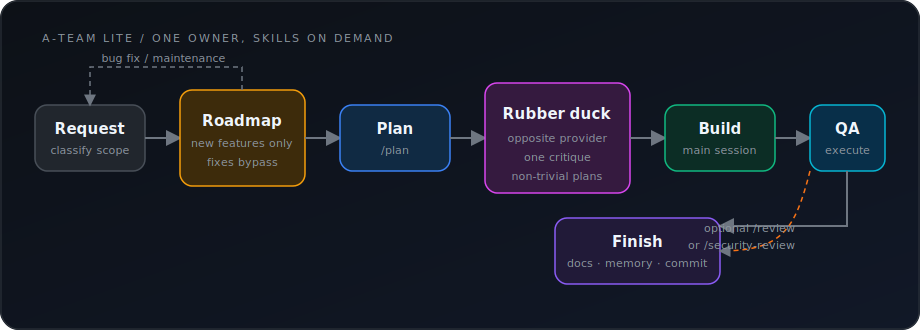

# A-Team

A squad of custom [GitHub Copilot agents](https://code.visualstudio.com/docs/copilot/customization/custom-agents) for autonomous project development. No roleplay bullshit, just gets the job done.

*"I love it when a plan comes together."* — Hannibal

## Agents

Each agent uses whatever main model the session runs on — no models are hardcoded. The reviewer runs **2 parallel reviews** (the current main model + the opposite-provider SOTA, both at highest reasoning), followed by a consolidation pass on the current main model.

| Agent | Name | Role |
|-------|------|------|
| **orchestrator** | Hannibal | Leads the team, delegates to the right agent, commits after pipeline passes |
| **product-manager** | Stockwell | Scopes the mission: feature decomposition, roadmap, priorities |
| **planner** | Amy | Creates detailed implementation specs with architecture, subtasks, and acceptance scenarios |
| **designer** | Murdock | Owns `DESIGN.md` (visual identity contract). Runs brand discovery for new projects and creates per-feature UI/UX designs |
| **coder** | Baracus | Builds it. Implements features, writes tests, updates docs |
| **reviewer** | Decker | Adversarial review: opposite-provider SOTA + same-model, both at highest reasoning, then consolidated |
| **qa** | Lynch | Tests the running app, never stops probing |
| **marketer** | Face | Mostly on-demand: positioning, messaging, channels, content strategy, promo content. Owns `docs/marketing/MARKETING.md`. Auto-engages at MVP completion (first creation), at project inception (lightweight tagline pass), and when a feature spec mandates marketing artifacts |

## Setup

Add the agent squad to your project:

```bash
cd my-project
```

**Mac/Linux:**
```bash
curl -fsSL https://raw.githubusercontent.com/sinedied/a-team/main/setup.sh | bash
```

**Windows (PowerShell):**
```powershell
iwr -useb https://raw.githubusercontent.com/sinedied/a-team/main/setup.ps1 -OutFile setup.ps1; .\setup.ps1; rm setup.ps1
```

Files are installed in the current directory. Existing files are never overwritten without confirmation.

To install a specific version, pass `-v <tag-or-branch>`:

```bash
# Mac/Linux
curl -fsSL https://raw.githubusercontent.com/sinedied/a-team/main/setup.sh | bash -s -- -v v1.0

# Windows
iwr -useb https://raw.githubusercontent.com/sinedied/a-team/main/setup.ps1 -OutFile setup.ps1; .\setup.ps1 -v v1.0; rm setup.ps1
```

## Skills

The squad includes built-in skills that agents use automatically:

| Skill | Used by | Description |
|-------|---------|-------------|
| **roadmap** | Product Manager | Creates or iterates on `docs/specs/roadmap.md` via an interview, intermediate validation, and adversarial review. Handles initial scoping and reprioritization |
| **brand** | Designer | Establishes or evolves the project's visual identity in `DESIGN.md` via an interview-style discovery. Locks decisions as they're made, validates with Google's DESIGN.md lint |
| **marketing** | Marketer | Establishes or evolves marketing identity in `docs/marketing/MARKETING.md` — positioning, audience, messaging, channels, content strategy. Truth-checks all claims against the codebase, enforces anti-slop guardrails |
| **frontend-design** | Designer | Guides creation of distinctive, production-grade UI that avoids generic AI aesthetics |
| **chrome-devtools** | QA | Controls a live Chrome browser for visual testing, screenshots, and DOM inspection. Auto-configures the MCP server when needed. |

<details>
<summary>Configuring chrome-devtools for GitHub Copilot cloud agent</summary>

The chrome-devtools skill auto-configures in VS Code and Copilot CLI. For the **GitHub Copilot cloud agent** (SWE agent), you need to configure the MCP server manually in your repository settings:

1. Go to your repository on GitHub.com
2. Navigate to **Settings → Code & automation → Copilot → Cloud agent**
3. Add the following to the **MCP configuration** section:

```json
{
  "mcpServers": {
    "chrome-devtools": {
      "type": "local",
      "command": "npx",
      "args": ["-y", "chrome-devtools-mcp@latest", "--headless"],
      "tools": ["*"]
    }
  }
}
```

Chrome runs in headless mode in the cloud agent environment. You may also need a `copilot-setup-steps.yml` to install Chrome in the runner — see [GitHub docs](https://docs.github.com/en/copilot/how-tos/use-copilot-agents/cloud-agent/extend-cloud-agent-with-mcp).

</details>

## Workflow



## Shared Memory

All agents read and write to `docs/memory/`:
- `docs/memory/decisions.md` — Architectural and design decisions
- `docs/memory/conventions.md` — Established project conventions

## Generated Artifacts

The agents produce artifacts during the pipeline. These are committed alongside the code:

| Path | Contents | Written by |
|------|----------|------------|
| `DESIGN.md` | Visual identity contract — colors, typography, components, voice, motion (follows [Google's DESIGN.md spec](https://github.com/google-labs-code/design.md)) | Designer |
| `docs/specs/` | Implementation specs with architecture, subtasks, acceptance scenarios, and decisions | Planner |
| `docs/qa/` | QA test logs — scenarios tested, edge cases, issues found (persists across sessions) | QA |
| `docs/memory/` | Shared decisions and conventions | All agents |
| `docs/brand/` *(optional)* | HTML brand book, UI kit, and demo page derived from `DESIGN.md` | Designer |
| `docs/marketing/` *(on-demand)* | `MARKETING.md` (positioning, messaging, channels) + dated per-engagement promo content (`<yyyy-mm-dd>_<slug>.md`) | Marketer |

## License

[MIT](LICENSE)
