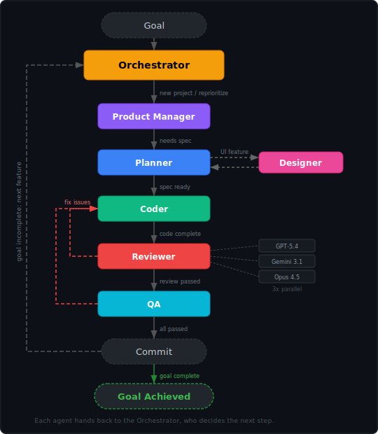

# A-Team

A squad of custom [GitHub Copilot agents](https://code.visualstudio.com/docs/copilot/customization/custom-agents) for autonomous project development. No roleplay bullshit, just gets the job done.

*"I love it when a plan comes together."* — Hannibal

## Agents

| Agent | Name | Role | Model |
|-------|------|------|-------|
| **orchestrator** | Hannibal | Leads the team, delegates to the right agent, commits after pipeline passes | Sonnet 4.6 |
| **product-manager** | Face | Scopes the mission: feature decomposition, roadmap, priorities | Opus 4.6 |
| **planner** | Amy | Creates detailed implementation specs with architecture and subtasks | Opus 4.6 |
| **designer** | Murdock | Creative UI/UX design using the `frontend-design` skill | Opus 4.6 |
| **coder** | Baracus | Builds it. Implements features, writes tests, updates docs | Opus 4.6 |
| **reviewer** | Decker | Adversarial reviews (spawned 3× with diverse models) | GPT-5.4, Gemini 3.1 Pro, Opus 4.5 |
| **qa** | Lynch | Tests the running app, never stops probing | Opus 4.6 |

## Setup

Add the agent squad to your project:

```bash
cd my-project
```

**Mac/Linux:**
```bash
curl -fsSL https://raw.githubusercontent.com/sinedied/a-team/main/setup.sh | bash
```

**Windows (PowerShell):**
```powershell
iwr -useb https://raw.githubusercontent.com/sinedied/a-team/main/setup.ps1 -OutFile setup.ps1; .\setup.ps1; rm setup.ps1
```

Files are installed in the current directory. Existing files are never overwritten without confirmation.

## Skills

The squad includes two built-in skills that agents use automatically:

| Skill | Used by | Description |
|-------|---------|-------------|
| **frontend-design** | Designer | Guides creation of distinctive, production-grade UI that avoids generic AI aesthetics |
| **chrome-devtools** | QA | Controls a live Chrome browser for visual testing, screenshots, and DOM inspection. Auto-configures the MCP server when needed. |

<details>
<summary>Configuring chrome-devtools for GitHub Copilot cloud agent</summary>

The chrome-devtools skill auto-configures in VS Code and Copilot CLI. For the **GitHub Copilot cloud agent** (SWE agent), you need to configure the MCP server manually in your repository settings:

1. Go to your repository on GitHub.com
2. Navigate to **Settings → Code & automation → Copilot → Cloud agent**
3. Add the following to the **MCP configuration** section:

```json
{
  "mcpServers": {
    "chrome-devtools": {
      "type": "local",
      "command": "npx",
      "args": ["-y", "chrome-devtools-mcp@latest", "--headless"],
      "tools": ["*"]
    }
  }
}
```

Chrome runs in headless mode in the cloud agent environment. You may also need a `copilot-setup-steps.yml` to install Chrome in the runner — see [GitHub docs](https://docs.github.com/en/copilot/how-tos/use-copilot-agents/cloud-agent/extend-cloud-agent-with-mcp).

</details>

## Pipeline



## Shared Memory

All agents read and write to `memory/`:
- `memory/decisions.md` — Architectural and design decisions
- `memory/conventions.md` — Established project conventions

## Generated Artifacts

The agents produce artifacts during the pipeline. These are committed alongside the code:

| Directory | Contents | Written by |
|-----------|----------|------------|
| `specs/` | Implementation specs with architecture, subtasks, and decisions | Planner |
| `qa/` | QA test logs — scenarios tested, edge cases, issues found (persists across sessions) | QA |
| `memory/` | Shared decisions and conventions | All agents |

## License

[MIT](LICENSE)
