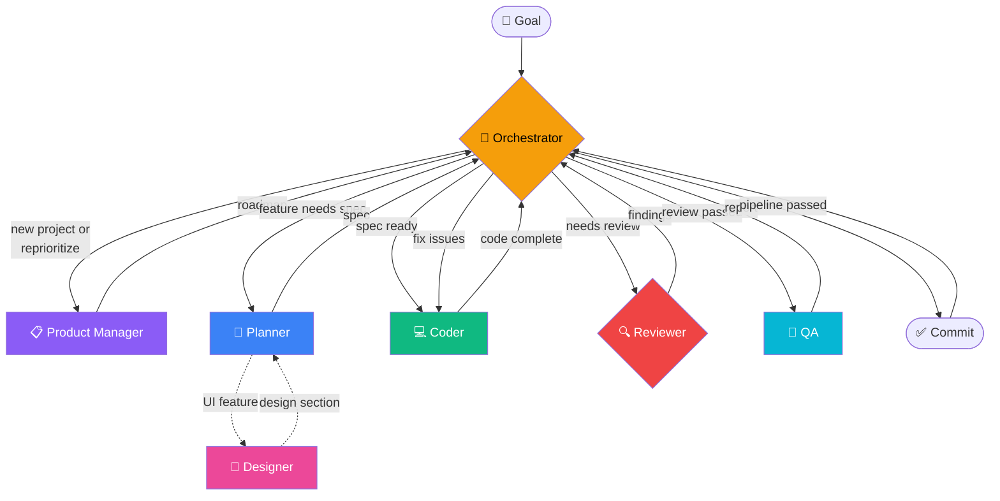

# A-Team

A squad of custom [VS Code Copilot agents](https://code.visualstudio.com/docs/copilot/customization/custom-agents) for autonomous project development.

## Agents

| Agent | Role | Model |
|-------|------|-------|
| **orchestrator** | Assesses project state, delegates to the right agent, commits after pipeline passes | Sonnet 4.6 |
| **product-manager** | Decomposes goals into features, creates and maintains the roadmap | Opus 4.6 |
| **planner** | Creates detailed implementation specs with architecture, subtasks, and constraints | Opus 4.6 |
| **designer** | Handles UI/UX design using the `frontend-design` skill | Opus 4.6 |
| **coder** | Implements features, writes tests, updates docs | Opus 4.6 |
| **reviewer** | Adversarial code and architecture reviews (spawned 3× with diverse models) | GPT-5.4, GPT-5.3-Codex, Opus 4.5 |
| **qa** | Tests the running app from a user perspective | Opus 4.6 |

## Pipeline



```
Goal → orchestrator → product-manager (roadmap)
     → orchestrator → planner (+ designer if UI) → coder → reviewer (3-model) → qa
     → orchestrator → commit → next feature
```

## Shared Memory

All agents read and write to `memory/`:
- `memory/decisions.md` — Architectural and design decisions
- `memory/conventions.md` — Established project conventions

## Setup

Scaffold a new project with the agent squad:

**Mac/Linux:**
```bash
curl -fsSL https://raw.githubusercontent.com/sinedied/a-team/main/setup.sh | bash -s ./my-project
```

**Windows (PowerShell):**
```powershell
iwr -useb https://raw.githubusercontent.com/sinedied/a-team/main/setup.ps1 -OutFile setup.ps1; .\setup.ps1 ./my-project; rm setup.ps1
```

This copies the agent definitions, shared memory, and specs directory into your project — excluding the README, LICENSE, and setup scripts.

## License

[MIT](LICENSE)
